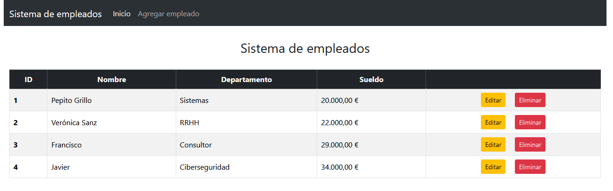
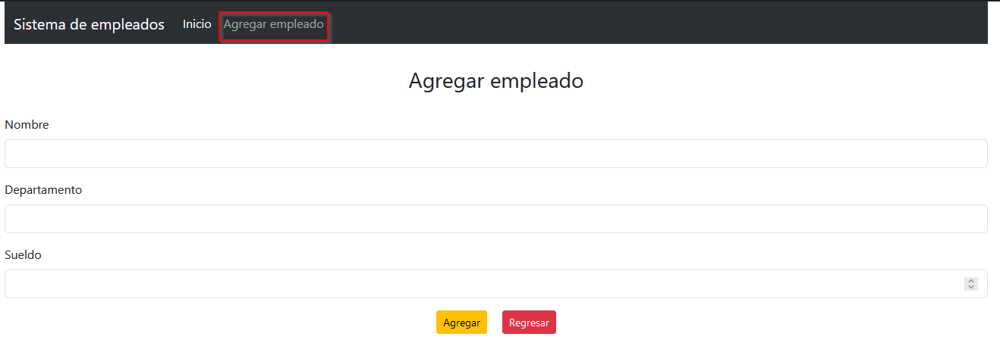
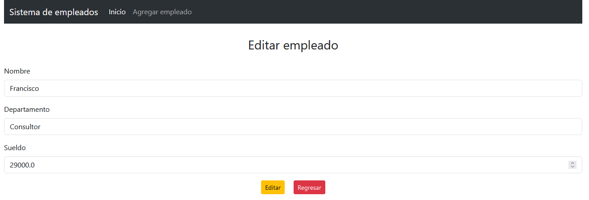

# Sistema de Empleados con JSPs y Spring Boot

Esto es un pequeño programa para guardar empleados por nombre, departamento y sueldo.

Esta es la página de inicio, donde nos muestran todos los empleados que hemos ido creando:

Esta es la página de agregar empleado, donde podemos añadir empleado por nombre, departamento y sueldo:

Si damos al botón editar, a la derecha de cada empleado, nos lleva a la siguiente página:

Donde podemos modificar los datos de nuestro empleado y guardarlos en memoria.

Si por el contrario damos a eliminar, lo borramos de la base de datos, y nos hace un refresh.

## Tech Stack

**Client:** Java, Spring Boot, Bootstrap

**Server:** MySQL, XAMPP